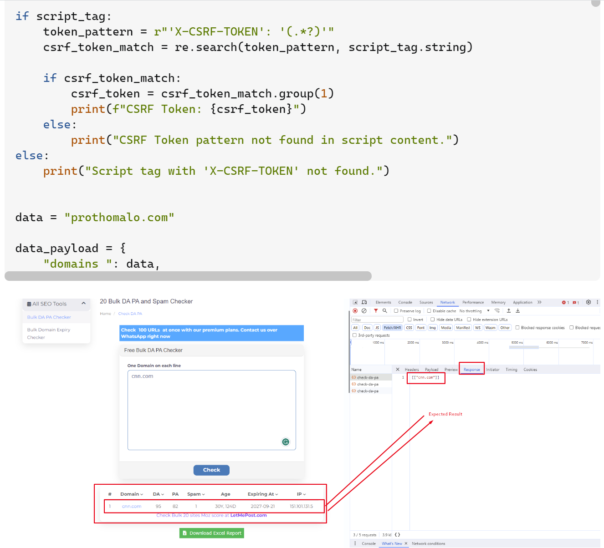
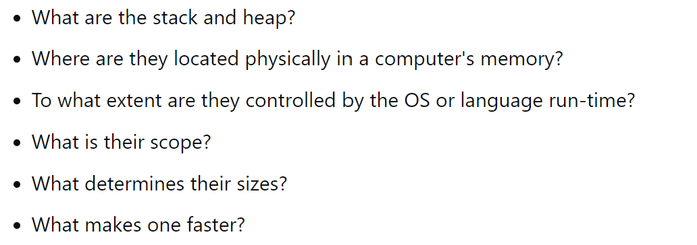

“A prudent question is one half of wisdom.” - Francis Bacon. Understandably, it’s naturally difficult to admit when lost and needing guidance. However, there are just some questions that can be too difficult to try and answer by oneself. Although there’s no need to feel ashamed in asking for help, asking a “smart” question can help lessen the embarrassment. 

## Why Bother With Smart Questions?	

The only way to create a smart question is to build up from a “not smart” question. Developing a smart question involves giving time to research and understand the ideas behind your problem. In doing so, you may find the answer to the question you’ve been looking for. If not, you’ve at least shown the people you are asking for help a couple of crucial things. One is that you’ve attempted to answer the question for yourself and are not trying to look for the easy way out. Two, you know the steps you’ve taken to solve your problem. And three, you’ve attempted to do a majority of the work and attempted numerous ways to try to find the answer to your problem, and because you were unsuccessful, you are now looking for help outside of the resources that you have.

Asking smart questions is one of the most critical skills for a software engineer and benefits you in many ways. As a software engineer, if you encounter problems, you have to be able to research. Second, your peers are most likely busy with their problems, so providing a concise writeup of how you attempted to solve your problem and the results of what occurred makes it easier for them to understand the situation and identify the issue. Time is money, especially in this industry, so knowing how to ask smart questions is essential.

## A Smart Question

Here is one such example of a smart question: (I’ll begin referring to the question asker as “Q” from here.) 

     

     
Q begins by providing us with background information about the specific goal they are attempting to accomplish. Q then informs the audience how they successfully obtained a response, but the problem is that the data is not received in the structure they expected. Q even provides a screenshot of how the output is displayed on their tool and an excerpt of their code, giving the audience more perspective. 

## A Not-So-Smart-Minimal-Effort Question

Now that we’ve seen an example of a smart question, let’s look at an example of a not-so-smart question:

     

Right off the bat, you can see little to no content in this question. The only thing Q does is list six questions regarding stacks and heaps. While this is an important question to know the general answer to, how this question was asked, in some regards, kind of looks like the post of someone making a last-ditch attempt to finish their homework questions without having to open a book and learn something. Since the question could’ve been answered with minimal research on Q’s part, it’s a not-so-smart question. Another thing that makes it a not-so-smart question is that due to the open-ended nature of this question, the answers Q will receive may not be the specific answers he wants.

## Conclusion

While asking smart questions is essential, the process, energy, time, and effort it takes to build a smart question is doubly so. It’ll help develop the skills and intuition necessary to become a better question-asker, problem solver, and, in doing so, a better software engineer.

<a href="https://stackoverflow.com/questions/77830117/web-scraping-and-post-request-issue-unable-to-retrieve-expected-data">Smart Question</a>
<a href="https://stackoverflow.com/questions/79923/what-and-where-are-the-stack-and-heap">Not-So-Smart Question</a>
