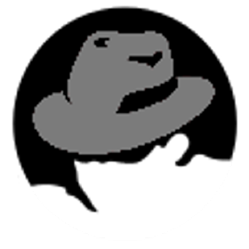

## What is GreyHats?

The GreyHats at the University of Hawai'i - Manoa is a registered independent organization that helps foster students' interest in cybersecurity and provides opportunities for them to develop these skills for use in practical settings. In one semester, I went from being a first-time member to becoming part of the board that regulated the club. Part of being on the board entails monitoring the GrayHats servers, researching topics to present at weekly seminars, creating practice exercises for members to demonstrate knowledge gained at weekly meetings, and organizing and promoting nationwide competitions such as the National Collegiate Cyber Defense Competition (CCDC), National Cyber League (NCL), and Hivestorm.

## My Responsibilities

As a member, I was introduced to a wide variety of topics including practice labs using virtual machines, password-cracking exercises, software reverse engineering, and binary exploitation. Now, transitioning into the role of a board member, one of my responsibilities is to present a seminar for the club members. These presentations require that I demonstrate my proficiency in the subject through thorough research and by creating engaging exercises that members can attempt themselves. 

## Future Goals

Last semester, I was invited by a friend at another university to participate in their Capture the Flag (CTF) challenge site. What was neat about their site challenges was that they had a large variety of challenges within each topic, so whether you were just starting out or had a lot of previous knowledge, you had the opportunity to learn from these challenges. The idea of developing a Manoa CTF site came to light after speaking with the GreyHats president and other cyber enthusiasts.

However, although there was a clear interest in having a Manoa CTF site, practical challenges, heavy workloads, and other club needs took priority. It became clear that a more extensive project such as this would take a lot more time to develop than what we had, so now it's just an idea we set on the back burner. 

## Reflection

Moving forward, I still believe that the benefits of developing a dedicated CTF site for Manoa make it worth the time needed to spend on this idea. Other than competitions, there aren't many deliverables that GreyHats can produce and showcase each member's skill and knowledge growth. The gap between members who actively explore cybersecurity on their own time and those who rely on the club to provide them guidance can be reduced if a platform such as this existed. Being that GreyHats is one of the main sources of exposure to cybersecurity for students, we do what we can by organizing seminars, exercises, and other engaging activities to continue to support Manoa students' interest in this field. 
